# Exo decompOser

Tu te rappelles de cette présentation en saison 2 ?

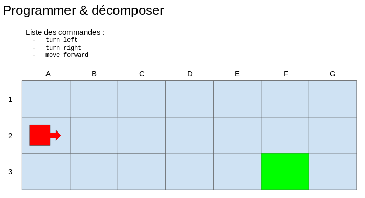

On présentait l'intérêt de bien décomposer son code en plusieurs instructions simples afin d'arriver à ses fins, c'est à dire la case F3.

Désormais, dans cet exercice, tu vas devoir coder le programme qui va lire les instructions et ensuite déplacer l'élément rouge.  
Autrement, tu vas coder un **interpréteur** d'un langage de programmation très simple, qui ne comprend que **3 instructions** :
- turn left
- turn right
- move forward

## Etapes

### 1 - Board :surfer: :snowboarder:

#### 1.1 - Board simple

On va commencer par dessiner la grille, la board, le plateau.

- déclarer la méthode `drawBoard()` dans `app` permettant de dessiner la board
- dans le code HTML, une div ayant l'id `board` est destinée à contenir le code HTML du plateau/board
- partons sur un plateau de 4 lignes et de 6 colonnes
- dans la méthode `drawBoard()` créer les div avec les bonnes classes pour avoir ces 4 lignes et 6 colonnes
- pour la partie esthétique, la feuille de style CSS te fournie tout ce dont tu as besoin

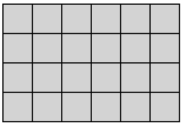

<details><summary>Code HTML du plateau</summary>

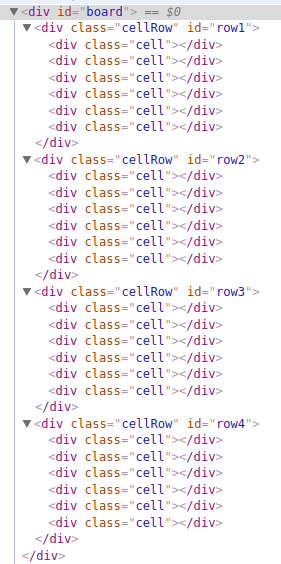

</details>

#### 1.2 - Cases de départ et d'arrivée

- définir la première case en haut à gauche comme départ
- définir la dernière case en bas à droite comme arrivée
- dans la méthode `drawBoard()` ajouter les classes CSS permettant de visualiser ces 2 cases

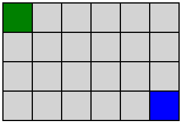

<details><summary>Code HTML du plateau</summary>

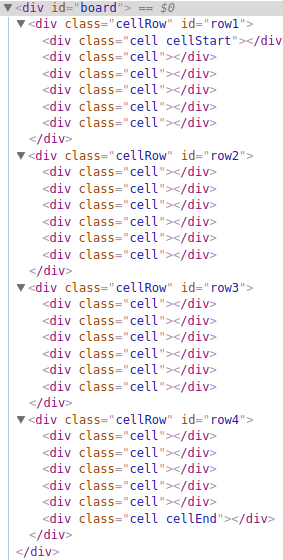

</details>

#### 1.3 - Curseur / élément rouge

- définir la position initiale du curseur rouge comme étant la case de départ
- dans la méthode `drawBoard()` ajouter les classes CSS permettant de visualiser ces 2 cases


<details><summary>Code HTML du plateau</summary>

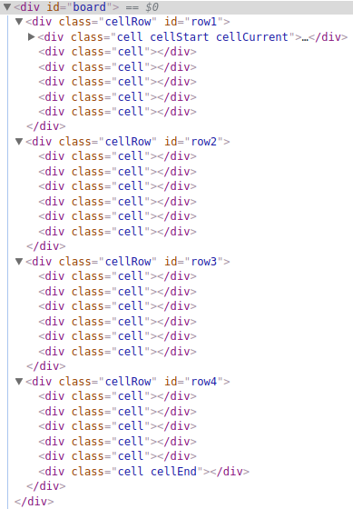

</details>

## 2 - Commandes :video_game:

### 2.1 - Avancer

- créer une méthode `moveForward()` permettant d'avancer le curseur
    - pour avancer, il faut savoir dans quelle direction le curseur est orienté
    - par défaut, le curseur est orienté vers la droite
    - la position du curseur va être modifiée par la méthode `moveForward()`
- pour tester, appeler cette méthode avant l'appel à la méthode `drawBoard()`
    - et vérifier que le curseur est bien avancé dans la bonne case
    - si la position est correcte dans le code mais qu'on ne la visualise pas correctement, moifier la méthode `drawBoard()` pour prendre en compte la position actuelle du curseur (cette position va changer dans le temps)

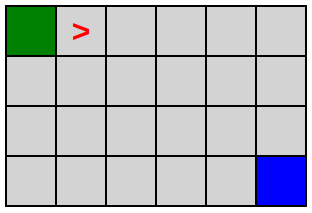

<details><summary>Code HTML du plateau</summary>

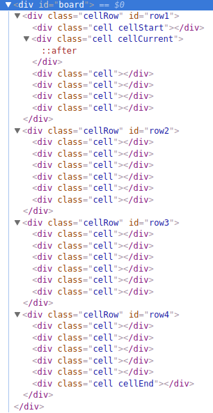

</details>

### 2.2 - Touner à droite

- créer une méthode `turnRight()` permettant de changer la direction du curseur
    - pour tourner, il faut savoir dans quelle direction le curseur est actuellement orienté
    - la position du curseur n'est pas modifiée
- pour tester, appeler cette méthode avant l'appel à la méthode `drawBoard()`, et après `moveForward()`
    - et vérifier que le curseur a bien avancé dans la bonne case
    - et que son orientation est bien vers le bas
    - si l'orientation est correcte dans le code mais qu'on ne la visualise pas correctement, moifier la méthode `drawBoard()` pour prendre en compte l'orientation actuelle du curseur (des classes CSS permettent de représenter l'orientation du curseur)


<details><summary>Code HTML du plateau</summary>

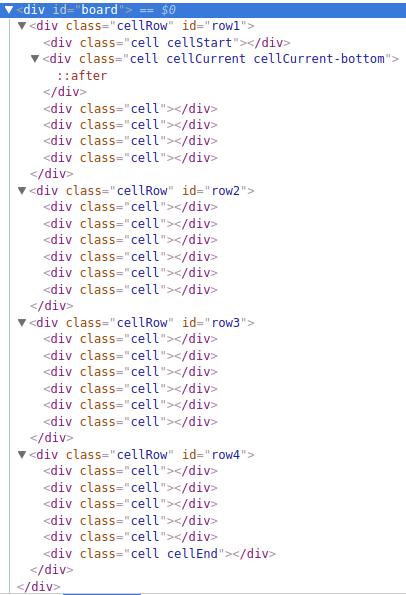

</details>

### 2.3 - Touner à gauche

- créer une méthode `turnLeft()` permettant de changer la direction du curseur
- après avoir tourné à droite pour tester `turnRight()`
    - avancer
    - puis tester la méthode `turnLeft()`

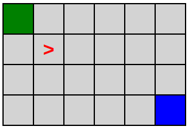

<details><summary>Code HTML du plateau</summary>

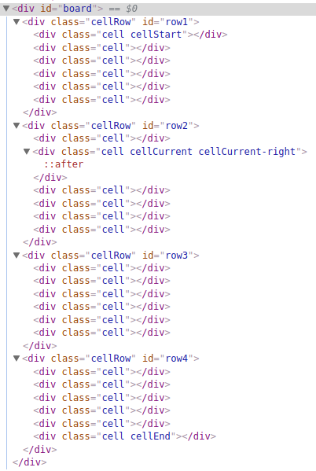

</details>

### 2.4 - Tests

- effectues plusieurs tests pour vérifier que les méthodes créées ont le comportement souhaité

## 3 - Interpréter le langage :computer:

### 3.1 - Lancer l'interpréteur

- au click sur le bouton _Launch script_, tu dois dire à JS d'exécuter la méthode `handleLaunchScriptButton()` fournie
- récupérer le contenu du textarea
- séparer chaque ligne du code => récupérer un "tableau de lignes"
    - une méthode Javascript te permet de faire cela facilement, à toi de trouver :wink:
- stocker le tableau de lignes dans une variable nommée `codeLines`
- laisser le code suivant à la fin de cette méthode
    - ce code permettra de boucler sur tout les lignes

<details><summary>Code à laisser tel quel</summary>

```js
    // Appel, après 2sec, la méthode codeLineLoop() avec la variable et l'index de départ (0)
    window.setTimeout(function() {
      app.codeLineLoop(codeLines, 0);
    }, 2000);
```

</details>

### 3.2 - Interpréter

- dans la méthode `codeLineLoop()` fournie
    - interpréter chaque ligne de code
    - effectuer l'action selon le code
- laisser le code suivant à la fin de la méthode `codeLineLoop()`
    - car elle s'occupe de boucler sur les lignes puis, une fois les lignes parcourues, lancer la méthode gérant la victoire ou non
    - et aussi, car ça permet d'afficher la board après chaque "mouvement"

<details><summary>Code à laisser tel quel</summary>

```js
    // Increment
    index++;

    // if still a line to interpret
    if (index < codeLines.length) {
      // Recall same method (=> make a loop)
      window.setTimeout(function() {
        app.codeLineLoop(codeLines, index);
      }, 1000);
    } else {
      window.setTimeout(function() {
        app.checkSuccess();
      }, 1000);
    }
```

</details>

### 3.3 - Erreurs

- dans la méthode `codeLineLoop()`
    - l'instruction notée dans le textarea peut ne pas être une des commandes du code
    - dans ce cas, arrêter la "boucle" et afficher une erreur

## 4 - You win ! :fireworks:

- une fois la "boucle" terminée
- la méthode fournie `checkSuccess()` est appelée
- cette méthode va tester si le curseur est bien dans la case d'arrivée
    - si oui => you win !
    - si non => you loose ...

## 5 - Faut pas déborder :pencil2:

- au moment d'avancer, il faut tester si on est pas sorti du cadre
- et si c'est le cas, afficher une erreur et arrêter le script

## 6 - Aléatoire :twisted_rightwards_arrows:

- rendre la case de départ aléatoire
- rendre la case d'arrivée aléatoire

# Bonus :rainbow:

Au choix, dans l'ordre voulu :wink:

- pouvoir relancer le script sans recharger la page
- autoriser des lignes vides dans le code
- autoriser des commentaires dans le code
